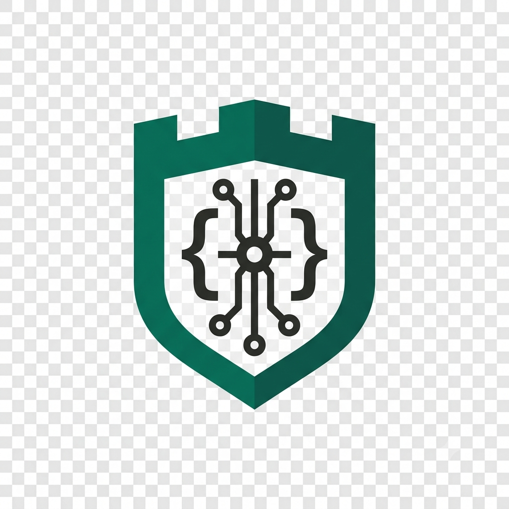
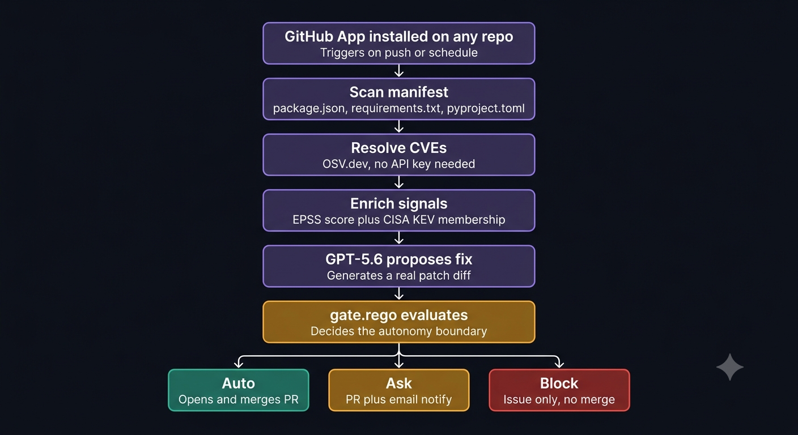
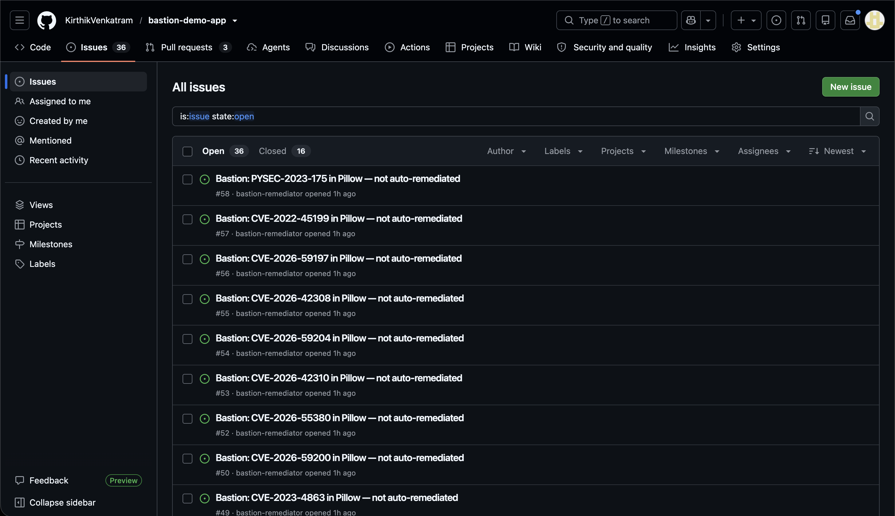
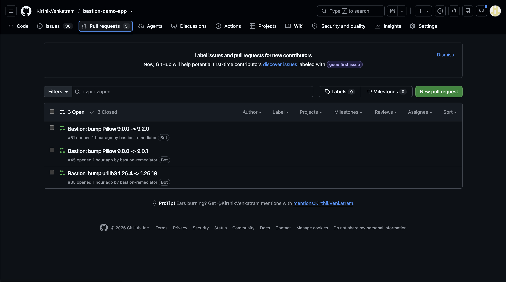
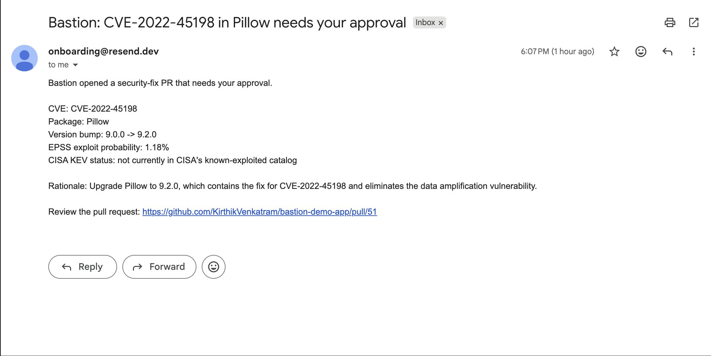

# Bastion

<p align="center">
  
</p>

**Exploitability-driven, policy-gated autonomous CVE remediation** — built with Codex and GPT-5.6 for OpenAI Build Week.

Bastion is a GitHub App that watches any repo, resolves its dependencies to known CVEs, and decides — using real exploit data, not vibes — whether to fix automatically, ask a human, or block entirely.

**[Install Bastion on your repo →](https://github.com/apps/bastion-remediator)**

## Architecture



1. Scan a repo's manifest (`package.json`, `requirements.txt`, `pyproject.toml`)
2. Resolve dependencies to CVEs via [OSV.dev](https://osv.dev)
3. Enrich each finding with an [EPSS](https://www.first.org/epss/) exploit-probability score and [CISA KEV](https://www.cisa.gov/known-exploited-vulnerabilities-catalog) status
4. GPT-5.6 proposes a real patch — a minimal, single-dependency version bump with a unified diff
5. An **OPA/Rego policy** (`policy/gate.rego`) — not the model — decides the outcome:
   - **Auto** — patch-level fix, actively exploited (CISA KEV), high EPSS score: opens and merges the PR automatically
   - **Ask** — real risk signal but not high-confidence enough to auto-merge: opens a PR and emails the maintainer for approval
   - **Block** — major version bump, or low-signal finding: opens an issue with reasoning only, no code change

The model proposes. Policy disposes. That boundary is explicit, auditable, and cannot be talked out of by a persuasive-sounding LLM response.

## See it in action

A real run against a test repo with outdated `requests`, `urllib3`, and `pyyaml`:

**Blocked — major version bump, policy declines to auto-fix:**


**Ask — patch-level fix, PR opened for review:**


**Ask — maintainer notified by email with the full risk picture:**


## Try it yourself

Install Bastion on any Python or Node repo with an outdated dependency, then push a commit. Bastion scans on push and acts within seconds — no setup on your end, judges test against our live deployment.

**[Install Bastion →](https://github.com/apps/bastion-remediator)**

Demo repo, if you want to see it fresh: [`bastion-demo-app`](https://github.com/KirthikVenkatram/bastion-demo-app)

## Local setup

```bash
git clone https://github.com/KirthikVenkatram/bastion
cd bastion
python3 -m venv .venv && source .venv/bin/activate
pip install -r requirements.txt
cp .env.example .env   # fill in your own keys

# OPA binary required for policy evaluation
curl -L -o /usr/local/bin/opa https://openpolicyagent.org/downloads/v1.18.2/opa_linux_amd64_static
chmod +x /usr/local/bin/opa

pytest -v               # 53 tests, full coverage across every module
uvicorn app.github_app.webhook:app --reload
```

Required env vars: GitHub App credentials, `GROQ_API_KEY` (fix proposals), `RESEND_API_KEY` + `NOTIFY_EMAIL_FROM` + `NOTIFY_EMAIL_TO` (ask-path notifications). See `.env.example` for the full list — OSV.dev, EPSS, and CISA KEV need no keys at all.

## Pipeline

```
GitHub App install → scan manifest → resolve CVEs (OSV.dev)
  → enrich (EPSS + CISA KEV) → GPT-5.6 proposes fix
  → gate.rego decides → auto-merge / ask (PR + email) / block (issue)
```

Deployed on Render, OPA bundled directly into the container — no separate policy service to manage.

## Built with Codex

This project was built across two Codex surfaces:

- **Codex Cloud** built the initial manifest scanner (`app/scanner/manifest.py`) end-to-end from a single prompt — parsing, tests, and fixtures, all in one PR.
- **Codex CLI** built everything after that — the OSV/EPSS/KEV enrichment clients, the GPT-5.6 fix-proposal module, GitHub App actions (branch, PR, merge, issue), the webhook entrypoint, and the pipeline wiring that ties it all together. Switching to CLI was a deliberate call after Codex Cloud hit platform-wide instability during Build Week's peak load — same agent, same model, just a more reliable loop for the rest of the build.

Every module was built with real, non-mocked test coverage reviewed before merging — 53 passing tests across scanner, enrichment, policy, GitHub actions, email, webhook, and pipeline orchestration. Along the way, Codex caught and fixed several real bugs surfaced by actual `pytest` runs: a scanner/pipeline desync from an unmerged branch, a broken control-flow path in the no-confident-fix case, a duplicate-issue bug across repeated scans, and a branch-collision bug when multiple CVEs resolved to the same target version. Every fix was verified against real test output, not assumed correct from a read of the diff.

`policy/gate.rego` — the autonomy-boundary logic — was hand-authored as the project's core IP; Codex built the application plumbing around it.

**Codex Session ID** (primary build thread): `019f6dc4-6519-7ac3-8f74-a4737f25189c`

## Built with GPT-5.6

GPT-5.6 — via Codex — wrote the large majority of this codebase. Inside the running application itself, GPT-5.6 also proposes every fix diff Bastion generates: given a CVE, its EPSS/KEV enrichment, and the current dependency version, it returns a minimal unified diff, a plain-language rationale for the PR description, and its own confidence assessment — which feeds the PR/issue text, but never the gate's decision. That boundary stays with policy, by design.

## Known limitations

- Multiple CVEs affecting the same package can currently generate separate PRs rather than consolidating into one fix — a production deployment would want per-package fix consolidation instead of per-CVE.
- Ecosystem support is currently Python and Node manifests; a broader rollout would add Go, Rust, and Java.
- The "ask" path's email notification is best-effort (Resend) and degrades gracefully if unconfigured — the PR itself remains the source of truth either way.

## License

MIT
